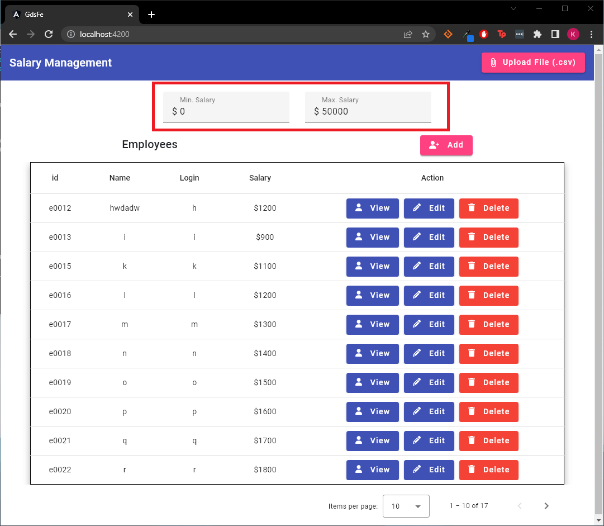
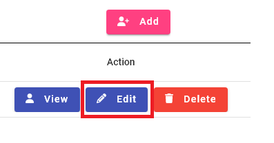
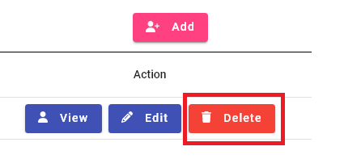

<!-- Improved compatibility of back to top link: See: https://github.com/othneildrew/Best-README-Template/pull/73 -->
<a name="readme-top"></a>
<!--
*** Thanks for checking out the Best-README-Template. If you have a suggestion
*** that would make this better, please fork the repo and create a pull request
*** or simply open an issue with the tag "enhancement".
*** Don't forget to give the project a star!
*** Thanks again! Now go create something AMAZING! :D
-->

<!-- PROJECT LOGO -->
<br />
<div align="center">
  <a href="https://github.com/keanetay624/gds-assignment">
  <picture>
    <source media="(prefers-color-scheme: dark)"  alt="Logo" srcset="./images/money-bill-solid-light.png" width="80" height="80">
    
  </picture>
  </a>
  </div>

<h3 align="center">Employee Salary Management</h3>

  <p align="center">
    Web application designed to make managing employee salaries for Human Resources simple, fun and easy to use.
  </p>


<!-- TABLE OF CONTENTS -->
<details>
  <summary>Table of Contents</summary>
  <ol>
    <li>
      <a href="#about-the-project">About The Project</a>
      <ul>
        <li><a href="#built-with">Built With</a></li>
      </ul>
    </li>
    <li>
      <a href="#getting-started">Getting Started</a>
      <ul>
        <li><a href="#prerequisites">Prerequisites</a></li>
        <li><a href="#installation">Installation</a></li>
      </ul>
    </li>
    <li><a href="#usage">Usage</a></li>
    <li><a href="#roadmap">Roadmap</a></li>
    <li><a href="#contributing">Contributing</a></li>
    <li><a href="#contact">Contact</a></li>
  </ol>
</details>


<!-- ABOUT THE PROJECT -->
## About The Project

<p align="center" width="100%">
     
</p>

The Human Resources department requires a webapp to manage employee salaries. They require a responsive, mobile-first experience
to view, edit and delete existing employee salary details. The app features a file upload feature so users can easily upload a list of employees for batch update or insert.

<p align="right">(<a href="#readme-top">back to top</a>)</p>


### Built With

This project is built with Java Spring Boot, Angular and MongoDB.
JUnit5 and Mockito are used for testing on the backend.

* [![Angular][Angular.io]][Angular-url]

<p align="right">(<a href="#readme-top">back to top</a>)</p>


<!-- GETTING STARTED -->
## Getting Started

To get a local copy up and running follow these simple example steps.

### Prerequisites

To get the project running, you will need JDK (17), Node, Angular (15.1) and Docker installed.
* JDK<br/>
  <a>https://docs.aws.amazon.com/corretto/latest/corretto-17-ug/downloads-list.html</a>
* Node<br/>
  <a>https://nodejs.org/en/download/</a>
* Docker<br/>
  <a>https://www.docker.com/products/docker-desktop/</a>
* Jetbrains IntelliJ IDEA - for running spring boot and docker-compose<br/>
  <a>https://www.jetbrains.com/idea/download/#section=windows</a>
* Angular - after installing node<br/>
  ```sh
  npm install -g @angular/cli
  ```
* Http server - for testing localization<br/>
  ```sh
  npm install http-server -g
  ```
### Installation

1. Clone the repo
   ```sh
   git clone https://github.com/keanetay624/gds-assignment.git
   ```
2. Install NPM packages
   ```sh
   npm install
   ```

### Starting the Application

1. Startup database containers
   - Two services in docker-compose.yaml need to be started to activate the database.
   - This can be easily achieved by clicking docker-compose up within an IDE like Jetbrains IntelliJ IDEA.
2. Start Spring Boot application
    - Navigate to /src/main/java/com.ecquaria.gds/GdsApplication
    - Click on Run Spring Boot Application.
3. Start Angular application
    - Navigate to /gds-fe/
    - Open up a cmd shell from this path
    - Run the angular command for starting the application
     ```sh
   ng serve
   ```
4. Access the application frontend
    - Open your web browser of choice and navigate to localhost:4200.
    - The application is now ready for use. 


<p align="right">(<a href="#readme-top">back to top</a>)</p>

<!-- USAGE EXAMPLES -->
## Usage
### Filtering Employees by Salary
To filter employees by salary range, enter minimum and maximum salary in the form above. The filtering happens automatically
after the user provides a minimum and maximum salary, and will trigger a refresh of the list of employees below.

<p align="center" width="100%">
     
</p>

Note that there is also output for unsuccessful data retrieval due to invalid user input, such as negative values for salary,
and minimum salary greater than max salary.
<p align="center" width="100%">
    
     
</p>

### Viewing an Employee
To view details for a specific employee, click on any field in the employee record. A dialog will open with employee information. Data is not-editable in this dialog. 

<p align="center" width="100%">
     
     
</p>

### Adding an Employee
To add an employee, click on the Add button above the employees table. Note the following rules for successful employee insertion:
- All fields are required.
- id and login must be unique.
- salary must follow currency format:
  - only numeric characters allowed
  - only up to 2 decimal places allowed
  - only one decimal point is allowed

If the employee to insert passes these validation rules, it will be added to the database after clicking the Save button. To cancel this employee insertion, click on Close.

<p align="center" width="100%">
     
     
</p>

### Editing an Employee
To edit an employee, click on the Edit button above the employees table. Note that the id is a non-editable field. Additionally, there is some validation for successful editing of existing employee:
- All fields are required.
- Login must be unique.
- salary must follow currency format:
  - only numeric characters allowed
  - only up to 2 decimal places allowed
  - only one decimal point is allowed

If the employee to edit passes these validation rules, it's record in the database will be updated after clicking the Save button. To cancel this action, click on Close.

<p align="center" width="100%">
     
     
</p>

### Delete an Employee
To delete an employee, click on the Delete button in the action column. 
A confirmation dialog will open. The selected employee will be deleted once the user confirms this action.

<p align="center" width="100%">
     
     
</p>

### Uploading employee data in .csv file format
To batch insert or update employees within a csv file format, click on upload button on the navbar. 
For successful file upload, the following validation criteria is required to pass:
- First record is header information, and will be ignored
- Required columns are in this order: id, name, login, salary
- Duplicate id or logins are not permitted within the same .csv file.
- salary must follow currency format:
  - only numeric characters allowed
  - only up to 2 decimal places allowed
  - only one decimal point is allowed

If the file passes these validation checks, employees within the file not in the system will be inserted, and existing employee information will be updated. Just like for salary filtering, a snackbar notification will popup after file upload to show success or failure message.

<p align="center" width="100%">
     
</p>

### Internationalization (i18n)
The application has been internationalized and is ready to be localized.
As a proof-of-concept, the only locales currently supported are en-SG and zh (chinese).
To test the localized application, navigate to the gds/fe

1. Build the localized application
```sh
   ng-build --localize
   ```
2. Startup http server to serve the app locally.
```sh
   http-server ./dist/gds-fe
   ```
3. Open a web browser of choice, and access the url to the local web server.
4. Open EmployeeController.java, and update the origins url for the url of the local web server.
<p align="center" width="100%">
     
</p>
5. Select zh from the index-menu.
<p align="center" width="100%">
     
</p>

This will take you to the version of the application localized to Chinese language. 
To see the default version of the app in English, click on back, and select en-SG.

<p align="center" width="100%">
     
     
</p>

<p align="right">(<a href="#readme-top">back to top</a>)</p>


<!-- ROADMAP -->
## Roadmap

- [x] UI Localization
- [ ] Better UX When Uploading Large CSV Files
- [ ] Testing of Api endpoints with Rest Assured
- [ ] Testing of frontend with Selenium
<p align="right">(<a href="#readme-top">back to top</a>)</p>


<!-- CONTRIBUTING -->
## Contributing

Contributions are what make the open source community such an amazing place to learn, inspire, and create. Any contributions you make are **greatly appreciated**.

If you have a suggestion that would make this better, please fork the repo and create a pull request. You can also simply open an issue with the tag "enhancement".
Don't forget to give the project a star! Thanks again!

1. Fork the Project
2. Create your Feature Branch (`git checkout -b feature/AmazingFeature`)
3. Commit your Changes (`git commit -m 'Add some AmazingFeature'`)
4. Push to the Branch (`git push origin feature/AmazingFeature`)
5. Open a Pull Request

<p align="right">(<a href="#readme-top">back to top</a>)</p>

<!-- CONTACT -->
## Contact

Keane Tay - keanetay@ecquaria.com

Project Link: https://github.com/keanetay624/gds-assignment

<p align="right">(<a href="#readme-top">back to top</a>)</p>

<!-- MARKDOWN LINKS & IMAGES -->
<!-- https://www.markdownguide.org/basic-syntax/#reference-style-links -->
[Angular.io]: https://img.shields.io/badge/Angular-DD0031?style=for-the-badge&logo=angular&logoColor=white
[Angular-url]: https://angular.io/